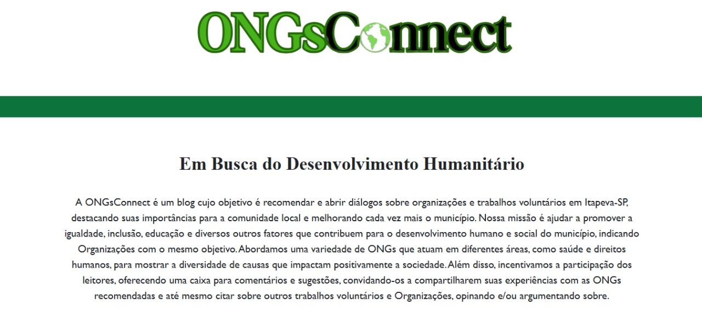

# 💝 ONGsConnect

Aplicativo web informativo que apresenta e divulga Organizações Não Governamentais (ONGs) da cidade de Itapeva-SP, aproximando a comunidade de instituições que promovem ações sociais como educação, inclusão, voluntariado e assistência social.



## 🚀 Funcionalidades

* 📋 Visualizar lista de ONGs cadastradas
* 🏢 Acessar informações detalhadas de cada instituição (endereço, telefone, e-mail, missão, etc.)
* ✉️ Enviar comentários, dúvidas ou sugestões via formulário
* 📄 Visualizar comentários enviados anteriormente

## 🛠️ Tecnologias utilizadas


## 📦 Instalação

Clone o repositório:

```bash
git clone https://github.com/IgorVernequeDev/ONGsConnect.git
```

Entre na pasta do projeto:

```bash
cd ONGsConnect
```

Abra o arquivo no navegador (HTML/CSS/JS puro, sem servidor necessário):

```bash
index.html
```

Ou publique diretamente em **GitHub Pages**.

## 🎯 Objetivo do projeto

* Criar uma plataforma web informativa e acessível
* Promover a visibilidade de ONGs locais
* Incentivar participação cidadã e voluntariado
* Praticar desenvolvimento front-end com HTML, CSS e JavaScript

## 👨‍💻 Autor

Desenvolvido por *Igor Verneque*
