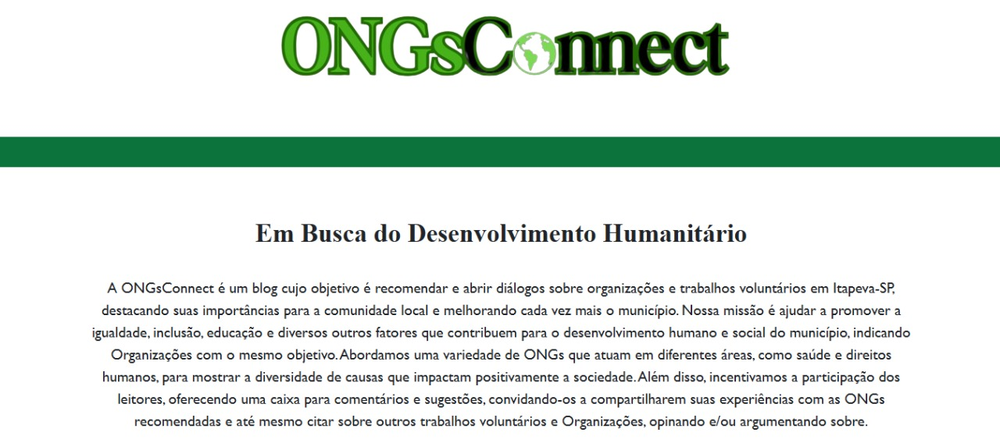

# ONGsConnect

**Descrição:**  
O ONGsConnect é um site informativo criado com o objetivo de apresentar e divulgar Organizações Não Governamentais (ONGs) da cidade de Itapeva-SP. O projeto visa incentivar a participação cidadã, aproximando a comunidade de instituições que promovem ações sociais importantes como educação, inclusão, voluntariado e assistência social.

## Índice
* [Funcionalidades](#funcionalidades)
* [Tecnologias](#tecnologias-utilizadas)
* [Autor](#autor)
* [Licença](#licença)

### Funcionalidades:
* Visualizar lista de ONGs cadastradas.
* Acessar informações detalhadas de cada instituição (endereço, telefone, e-mail, missão, etc.).
* Enviar comentários, dúvidas ou sugestões via formulário.
* Visualizar os comentários enviados anteriormente.
* Excluir entradas da seção de comentários.

## Tecnologias Utilizadas

#### Front-end:

#### Hospedagem:

## Autor
* Igor de Almeida Verneque - [GitHub](https://github.com/IgorVernequeDev) - igorverneque5@gmail.com

## Licença
Este projeto está licenciado sob a Licença MIT - veja o arquivo LICENSE para mais detalhes.
